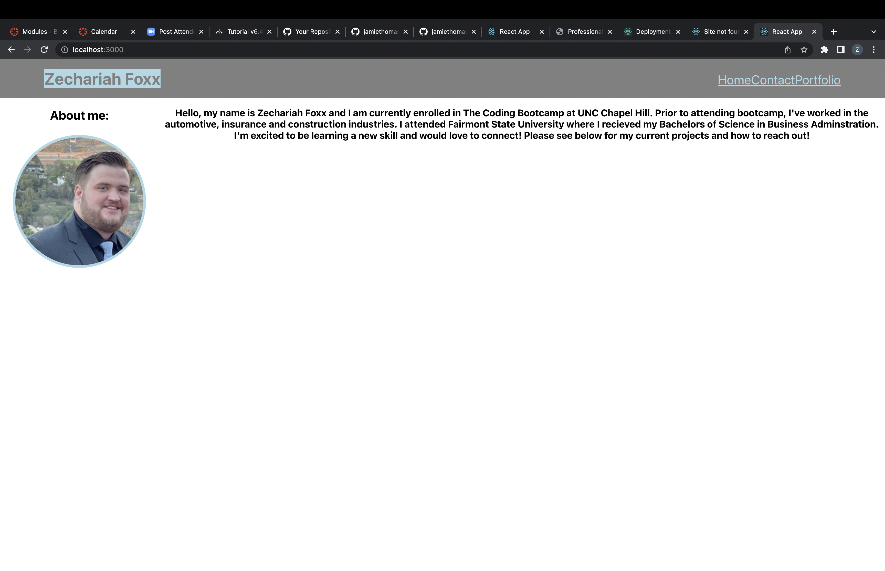

Created a single-page application portfolio using React  
So that when the portfolio loads, a page contains a header, a section for content, and a footer  
When viewing the header, the user is presented with a page containing a header, a section for content and a footer  
Then the user is presented with the developer's name and navigation with titles corresponding to different sections of the portfolio  
When navigating the titles, the user is presented with the titles About Me, Portfolio, Contact and Resume, and the title corresponding to the current section is highlighted.  
When the user clicks on a navigation title, the user is presented with corresponding section below the navigation without the page reloading and that title is highlighted  
When loading the portfolio for he first time, the About Me title and section are selected by default  
When presented with the About Me section, the user sees a recent photo and short bio  
When presented with the portfolio, the user will see six of application with links to the deployed application and github repository  
When presente with the Contacts section, the user will see a contact form with fields for a name, email address, and message  

